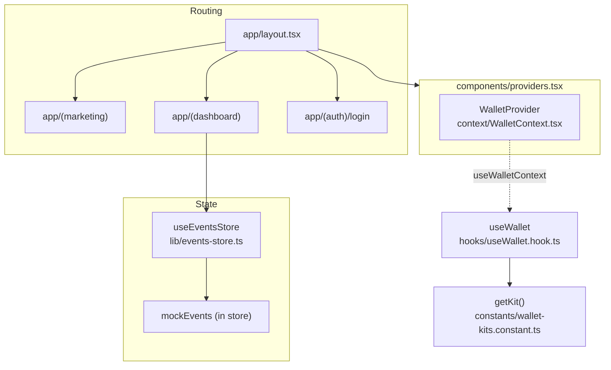

# Architecture Overview

A top-level map of the Predictify frontend: how routes are grouped, how state
flows, how the wallet layer works, and how components are organized. Every path
below is a real file or directory in this repository.

> Status note: several data flows are still **mocked** today. Those points are
> flagged inline and summarized in [API.md](./API.md). This document describes the
> structure as it exists now, not an aspirational design.

## Stack

- **Framework:** Next.js 15 App Router with React 19
- **Language:** TypeScript
- **State:** Zustand store (`lib/events-store.ts`) plus React Context
  (`context/WalletContext.tsx`)
- **Wallet:** [`@creit.tech/stellar-wallets-kit`](https://github.com/Creit-Tech/Stellar-Wallets-Kit)
- **Package manager:** pnpm (`pnpm@10.18.3`)

## Route groups

Routing lives under [`app/`](../app) and uses App Router
[route groups](https://nextjs.org/docs/app/building-your-application/routing/route-groups)
(the parenthesized folders) to apply different layouts without affecting the URL
path.

| Route group | Folder | Layout | Purpose |
| --- | --- | --- | --- |
| Marketing | [`app/(marketing)`](<../app/(marketing)>) | [`app/(marketing)/layout.tsx`](<../app/(marketing)/layout.tsx>) | Public landing page. Sections and pieces live in `app/(marketing)/_sections` and `app/(marketing)/_components`. |
| Dashboard | [`app/(dashboard)`](<../app/(dashboard)>) | [`app/(dashboard)/layout.tsx`](<../app/(dashboard)/layout.tsx>) | Authenticated app surface: `dashboard`, `events`, `events-virtualized`, `bets`, `disputes`, `mypredictions`, `finances`, `profile`, `settings`, `verification`, `help`, and the demo routes. |
| Auth | [`app/(auth)`](<../app/(auth)>) | (inherits root layout) | Authentication routes. Currently `app/(auth)/login`. |

The root layout [`app/layout.tsx`](../app/layout.tsx) wraps every group. It loads
fonts and global styles and mounts the client providers via
[`components/providers.tsx`](../components/providers.tsx).

There are also a few non-grouped routes used for design and content references:
[`app/design`](../app/design), [`app/design-system`](../app/design-system), and
[`app/content`](../app/content).

### Provider tree

`components/providers.tsx` composes the global providers in this order:

```
app/layout.tsx
└─ Providers (components/providers.tsx)
   └─ ErrorBoundary        (components/error-boundary.tsx)
      └─ ThemeProvider     (components/theme-provider.tsx)
         ├─ WalletProvider (context/WalletContext.tsx)
         │    └─ children  (route-group pages)
         └─ Toaster        (components/ui/sonner.tsx)
```

## State layer

State is intentionally split into two scopes.

### Events store (Zustand)

[`lib/events-store.ts`](../lib/events-store.ts) exports the `useEventsStore` hook.
It holds the events domain state and all of its actions:

- **Data:** `events`, `filteredEvents`, `loading`, `error`.
- **View state:** `filters` (`EventFilters`), `sort` (`EventSort`),
  `pagination` (`PaginationState`).
- **Infinite scroll:** `hasNextPage`, `isFetchingNextPage`, `lastFetchTime`, and
  the `STALE_TIME_MS` staleness check exposed through `isDataStale()`.
- **Actions:** `setFilters`, `setSort`, `setPagination`, `setSearch`,
  `setDateRange`, `setStatus`, `applyFilters`, `loadEvents`, `loadNextPage`,
  and `deleteEvent`.

The store also exports the helpers `getEventCounts`, `formatTimeRemaining`, and
`getTimeRemainingColor`.

> **Mocked today:** the store is seeded with an in-file `mockEvents` array, and
> `loadEvents` / `loadNextPage` simulate network latency with `setTimeout`. There
> is no real fetch yet. See [API.md](./API.md) for where a real call goes.

Consumers include [`components/events/events-section.tsx`](../components/events/events-section.tsx),
[`components/events/events-table.tsx`](../components/events/events-table.tsx),
[`components/events/events-toolbar.tsx`](../components/events/events-toolbar.tsx),
[`components/events/pagination.tsx`](../components/events/pagination.tsx),
[`components/events/virtualized-events-list.tsx`](../components/events/virtualized-events-list.tsx),
and [`components/navbar/SearchInput.tsx`](../components/navbar/SearchInput.tsx).

### Wallet context (React Context)

[`context/WalletContext.tsx`](../context/WalletContext.tsx) exports
`WalletProvider` and the `useWalletContext` hook. It stores `address`, `name`,
`connected`, and `isLoading`, exposes `connect()` / `disconnect()`, and persists
the session to `localStorage` under the key `predictify_wallet_state` so a
connection survives reloads.

### State and routing diagram



## Wallet layer

The wallet integration is built on Stellar Wallets Kit and layered on top of the
context above.

| Concern | File | Responsibility |
| --- | --- | --- |
| Session state | [`context/WalletContext.tsx`](../context/WalletContext.tsx) | Holds the connected address/name and persists it to `localStorage`. |
| Actions hook | [`hooks/useWallet.hook.ts`](../hooks/useWallet.hook.ts) | `connectWallet`, `disconnectWallet`, `signTransaction`, plus `isConnecting` / `error` / `isConnected` / `walletAddress` / `walletName`. Reads session through `useWalletContext`. |
| Kit factory | [`constants/wallet-kits.constant.ts`](../constants/wallet-kits.constant.ts) | Lazily builds a client-only `StellarWalletsKit` via `getKit()`, defaulting to Freighter (`FREIGHTER_ID`) and `allowAllModules()`. Network comes from `getClientConfig()`. |

Connection flow: a UI action calls `connectWallet(walletId)` in `useWallet`,
which gets the kit, reads the address, maps the wallet id to a display name
(Freighter, LOBSTR, XBull, Albedo, Rabet), and calls `connect()` on the context.
`signTransaction(xdr)` signs through the kit using the connected address.

UI entry points: [`components/navbar/ConnectWalletAction.tsx`](../components/navbar/ConnectWalletAction.tsx),
[`components/navbar/WalletMenu.tsx`](../components/navbar/WalletMenu.tsx), and
[`components/connect-wallet-modal.tsx`](../components/connect-wallet-modal.tsx).

> **Mocked / partial today:** `signTransaction` in `hooks/useWallet.hook.ts` uses
> `WalletNetwork.TESTNET` directly rather than the configured network, and there is
> no on-chain submission step yet. Wallet connection itself is real.

## Component organization

Components live under [`components/`](../components), grouped by concern. The most
relevant groups for this overview:

| Group | Folder | Contents |
| --- | --- | --- |
| UI primitives | [`components/ui`](../components/ui) | Reusable, presentational primitives (`button.tsx`, `badge.tsx`, `calendar.tsx`, `back-to-top-fab.tsx`, and more), with tests under `components/ui/__tests__`. |
| Events | [`components/events`](../components/events) | Events domain UI: `events-section.tsx`, `events-table.tsx`, `events-table-skeleton.tsx`, `events-toolbar.tsx`, `pagination.tsx`, `virtualized-events-list.tsx`. These read from `useEventsStore`. |
| Disputes | [`components/disputes`](../components/disputes) | Dispute UI: `DisputePanel.tsx`, `DisputeStateBadge.tsx`, plus `shared/`, `states/`, and a local `mock-data.ts`. |
| Navbar | [`components/navbar`](../components/navbar) | Navigation and wallet entry points: `Navbar.tsx`, `MarketingNavbar.tsx`, `NavItem.tsx`, `MobileDrawer.tsx`, `SearchInput.tsx`, `NetworkSwitcher.tsx`, `ConnectWalletAction.tsx`, `WalletMenu.tsx`. |

Convention: primitives in `components/ui` are presentational and own appearance;
domain folders (`events`, `disputes`, `navbar`) compose those primitives and read
from the state layer.

## Where to read next

- [API.md](./API.md) for environment configuration, the events/transactions data
  shapes, and exactly where real API calls should be introduced.
- [README.md](./README.md) for the full documentation index.
